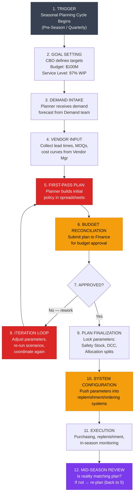
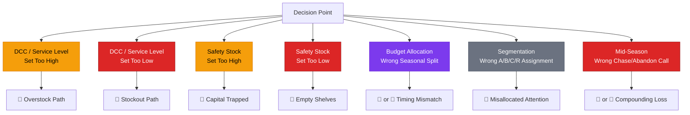

# Problem Reframe & User Workflow Map — Inventory Policy Workflow

## Document Status

> [!NOTE]
> **Version 3 — Post-Domain Exploration.** Updated with seasonal lifecycle context (pre-season / in-season / end-of-season), refined positioning as upstream of existing simulation capabilities, and clarified that the product is a policy optimizer, not a simulation. All open questions resolved. Operations/DC Lead removed from scope.

---

## Part 1 — Problem Reframe

### 1.1 The Problem We Originally Described

> "A business owner at Target in charge of Department 123 says: my budget is $100M and my target is 97% walk-in purchasability. Today they use spreadsheets to figure out what that means in terms of safety stock, in-stock targets, seasonal allocation, etc."

### 1.2 What's Wrong With This Framing

| Blind Spot | Why It Matters |
|---|---|
| **It assumes the input is clean** — "budget = $100M, target = 97%" | In reality, the budget is negotiated, contested, and often revised mid-cycle. The target is a political compromise, not a clean number. |
| **It assumes the bottleneck is computation** | Validated: 50% is keyboard work, but 30% is coordination and 20% is approvals. Computation is the plurality, not the whole story. |
| **It frames the output as "configurations"** | The real output is a *committed plan* that multiple stakeholders have signed off on. Configuration (safety stock, DCC, etc.) is the artifact — the *work* is building consensus around trade-offs. |

### 1.3 The Seasonal Lifecycle (Domain Context)

Retail inventory operates in three phases per season:

| Phase | Who Drives | Budget Commitment | How Policies Matter |
|---|---|---|---|
| **Pre-season** | Category Manager (manual POs) | 20-60% of seasonal demand (category-dependent: fashion = higher, basics = lower) | Pre-season commitment is irreversible — contractual obligations to vendors that "they end up buying" |
| **In-season** | Replenishment engine (automated) | Remaining 40-80% | **Policies set at start of season control the algorithms.** DCC, safety stock, reorder points, order frequency, MOQ thresholds — ALL feed the engine. Policies are sticky: DCC rarely changed, safety stock usually unchanged. |
| **End-of-season** | Manual POs | Remaining vendor commitments | Fulfilling contractual minimums; managing clearance |

> [!IMPORTANT]
> **The policies we're configuring are production parameters for an automated purchasing system.** Getting them wrong = programming a replenishment engine to spend millions incorrectly, on autopilot, for an entire season.

**Internal data science teams have built simulations** that show what a given set of configs will DO downstream (replenishment flow, PO behavior). But no tool answers the upstream question: **given my budget and goals, what should the configs BE?**

### 1.4 Reframed Problem Statement (Validated + Refined)

> [!IMPORTANT]
> **The core problem is that the step where inventory policies get *defined* — translating budget + goals into the configs that control automated replenishment — runs entirely in Excel, with no optimization, no scenario exploration, and no connection to budget constraints. Teams commit to policies after exploring 2-3 scenarios when 20+ should be evaluated, then those policies auto-execute for months.**

#### Component 1 — Scenario Exploration Is Prohibitively Expensive (at the Budget↔Policy Level)
Internal simulation can show what DCC=97% will do downstream. But no tool answers "given $100M and 97% WIP, should DCC be 97% for A-items, 93% for C-items, and 99% for R-items?" Each "what if" at the budget↔policy level requires manually reworking Excel. Everything happens in Excel first.

#### Component 2 — Cross-Functional Dependencies Create Sequential Bottlenecks
The planner can't finalize allocation without budget approval (finance), can't finalize parameters without vendor inputs. These happen sequentially. ~~Operations/DC validation~~ — **removed from scope** per user input: "no negotiations on operational impact at this stage."

#### Component 3 — The "Plan" Is Fragile and Non-Recoverable
Once the plan is set, re-planning mid-season has the same cost as original planning. Most teams absorb stockouts/markdowns rather than re-plan.

#### Component 4 — Institutional Knowledge Is Locked in Spreadsheet Formulas
Safety stock formulas, seasonal adjustment factors, and budget allocation logic live in inherited spreadsheets that few people fully understand.

### 1.5 What This Means for "What to Build"

**We are NOT building a simulation** (exists internally). We are building the step that comes BEFORE the simulation — the policy optimizer that figures out what the configs should be.

| Layer | What It Solves | Priority (from validation) |
|---|---|---|
| **Policy optimization layer** | Given budget + goals → compute optimal configs across all segments | 🔴 **#1** — this is the core gap. No tool does this today. |
| **Scenario exploration layer** | Instant what-if at the budget↔policy level (not config↔downstream) | 🔴 **#1** — 50% of time is keyboard work in Excel with zero tooling |
| **Collaboration layer** | Surface cross-functional dependencies for Finance + CBO | 🟡 **#2** — 30% coordination + 20% approvals |
| **Resilience layer** | Enable monthly/mid-season policy re-optimization at low cost | 🟡 **#3** — high-stakes decisions (V7) happen mid-season |
| **Knowledge layer** | Externalize logic from spreadsheets into transparent model | 🟠 **#4** — supports all other layers |

---

## Part 2 — Validated User Workflow Map

### 2.1 The Actors (Updated)

| Actor | Role | What They Care About | In Scope? |
|---|---|---|---|
| **Category Business Owner (CBO)** | Owns P&L for a department. Sets strategy. **PRIMARY USER.** | Budget efficiency, service level, markdown risk | ✅ Primary |
| **Inventory Planner** | Does the hands-on work of translating goals into parameters | Getting the math right, finishing on time | ✅ Secondary (later) |
| **Finance Partner** | Controls budget guardrails, approves allocation | Staying within capex budget | ✅ Stakeholder |
| **Vendor/Supplier Manager** | Provides lead time, MOQ, cost information | Vendor performance | ✅ Input provider |
| ~~Operations / DC Lead~~ | ~~Validates DC capacity~~ | ~~Throughput, labor cost~~ | ❌ **Out of scope** |
| **Adjacent Category Owners** | Own related departments, share budget or shelf space | Their own P&L; cannibalization risk | ⚠️ Edge case |
| **Demand Planning Team** | Provides demand forecasts | Forecast accuracy | ✅ Input provider |

> [!IMPORTANT]
> **Critical insight from V3:** The primary user is the **Category Business Owner (CBO)**, NOT the Inventory Planner. The CBO makes the strategic decisions and owns the P&L. The Planner "comes later" as a secondary user. This fundamentally changes what we build — the CBO doesn't want to fiddle with spreadsheet formulas. They want to **see trade-offs, make decisions, and move on.**

### 2.2 The Workflow — Step by Step (Validated)

> [!NOTE]
> Step 6 (Operations constraint check) has been removed from the flow. The workflow now goes directly from First-Pass Plan → Budget Reconciliation.

### 2.3 Detailed Breakdown — Key Steps

#### Steps 1-4: Trigger → Data Gathering (Days 1-7)
- CBO sets goals (budget + service level target)
- Planner receives demand forecast, collects vendor inputs
- **Validated:** 0% of bottleneck is waiting for inputs — this runs in parallel or is pre-available
- **Tools:** Email, meetings, Excel

#### Step 5: First-Pass Plan (🔴 PRIMARY PAIN ZONE — Days 5-12)
The planner opens their spreadsheet workbook (12-20 tabs) and:
1. Segments items into A/B/C/R tiers — **formula-driven with manual judgment overlay** + top-down inputs. ~10-20% of items shift segments quarter-to-quarter.
2. Sets target DCC per tier (A=98%, C=90%, R=99%)
3. Calculates safety stock per item-store cluster (e.g., 30% of POG capacity)
4. Runs OTB calculation
5. Allocates budget across pre-season / in-season / end-of-season
6. Checks if total fits budget → if not, adjusts parameters

**Tools:** Excel (primary). Enterprise tools have NO scenario capability — only user-built macros. All parameter changes happen in Excel first, then get pushed to enterprise systems.

#### Steps 6-8: Budget Reconciliation & Iteration (🔴 COMPOUNDING PAIN — Days 12-25)
- Finance pushes back → planner reworks → 2-3 iterations
- **Validated:** 30% coordination + 20% approvals = **50% of the cycle is non-computation**
- Each iteration erodes confidence; compromises are made to "make numbers work"

#### Steps 9-10: Plan Lock & System Config (🟡 RISK ZONE)
- Parameters (DCC, safety stock) are pushed into replenishment systems
- **Basic configs** (V7 validated): `DCC for SKU1 = 97%`, `Safety stock for SKU1 = 30% of POG`
- These are the routine outputs that could be auto-executed by the product

#### Steps 11-12: Execution & Mid-Season Review (🟣 HIGH-STAKES ZONE)
- **High-stakes decisions** (V7 validated):
  - "Underforecasted holiday by 20% for Product X, 1 week left — do we still place POs to vendor given committed quarterly forecast?"
  - "Transport cost doubled due to ops complexity — is it still worth bringing inventory to meet quarterly goal, or deviate to protect margins?"
- These require human judgment and CBO sign-off — product surfaces the trade-off, human decides

---

## Part 3 — User Journey & Emotional Map

### 3.1 The CBO's Journey (Primary User — Updated)

The CBO's pain is different from the Planner's. The CBO doesn't sit in spreadsheets — they **wait for answers, make decisions under uncertainty, and own the consequences.**

| Phase | CBO Experience | Internal Monologue |
|---|---|---|
| **Goal Setting** | Sets ambitious targets based on corporate strategy | "I need 97% WIP on $100M. I know it's tight but that's what the business needs." |
| **Waiting for Plan** | Delegated to planner, checks in periodically | "Where's the plan? It's been 10 days. I have a strategy review next week." |
| **Reviewing First Draft** | Receives plan, struggles to understand trade-offs | "If I push for 98% WIP, what does that cost me? I can't tell from this spreadsheet." |
| **Budget Negotiation** | Finance says cut $3M | "Which $3M? What's the least damaging cut? I need to see options, not just one answer." |
| **Approving Under Doubt** | Signs off on a plan they can't fully validate | "I'm approving this because we're out of time, not because I'm confident it's optimal." |
| **Mid-Season Crisis** | Demand diverges from plan | "We're 20% under on holiday — do we chase or accept the miss? What's the cost either way?" |

### 3.2 The Planner's Journey (Secondary User)

| Phase | Duration | Emotional State | Internal Monologue |
|---|---|---|---|
| **First-Pass Build** | Days 5-12 | 😰 Stressed | "This spreadsheet is a monster. If I change one number, 6 tabs break." |
| **Scenario Exploration** | Days 10-14 | 😩 Exhausted | "Each scenario takes 4 hours. I can only afford 2-3." |
| **Iteration Hell** | Days 18-25 | 😵 Burnt Out | "3rd revision. Lost track of changes. Which spreadsheet is current?" |
| **Plan Lock** | Days 22-28 | 😮‍💨 Relieved but doubtful | "It's probably 15% less efficient than optimal but I can't keep iterating." |

---

## Part 4 — Core Pain Points (Validated & Ranked)

| Rank | Pain Point | Who Feels It | Severity | Why Current Tools Fail |
|---|---|---|---|---|
| **#1** | **Scenario exploration is prohibitively expensive** — each "what if" takes hours; only 2-3 get explored | CBO + Planner | 🔴 Critical | Enterprise tools = zero scenario capability. Only user-built Excel macros. |
| **#2** | **Budget trade-offs are blind** — "cut $3M" has no fast way to see optimal cuts vs. service-level impact | CBO + Finance | 🔴 Critical | No tool links budget ↔ service-level at item-cluster granularity in real time |
| **#3** | **Mid-season decisions are made without data** — high-stakes calls (chase demand? absorb loss?) lack quantified trade-offs | CBO | 🔴 Critical | Re-planning cost ≈ original planning cost; irrational under time pressure |
| **#4** | **Iteration cycles are sequential and slow** — Finance pushback → full rework | Planner + Finance | 🟡 Important | No shared surface where stakeholders see constraint impacts live |
| **#5** | **Spreadsheet logic is fragile and opaque** — inherited formulas, no version control | Planner | 🟡 Important | Enterprise tools too rigid; planners use Excel for flexibility |
| **#6** | **Plan-to-system configuration gap** — manual transcription introduces silent errors | Planner | 🟡 Important | No automated bridge between planning output and system input |
| **#7** | **Item segmentation drift** — 10-20% of items shift segments quarterly; plans don't auto-adjust | Planner + CBO | 🟠 Moderate | Static segments in spreadsheets; no dynamic reclassification |

### The One-Sentence Problem (Updated for CBO)

> **Category business owners are forced to approve $100M inventory plans they can't fully validate, based on 2-3 scenarios when 20+ should be explored, with no ability to instantly see the cost of trade-offs or re-plan when reality diverges.**

---

## Part 5 — V8: The Cost of Being Wrong

> [!CAUTION]
> This section maps every way the inventory policy can be wrong, what happens downstream, and the $ impact at $100M budget scale. This is the "why it matters" section.

### 5.1 The Decision Points Where Things Go Wrong

### 5.2 Failure Modes — Detailed

#### ❌ Failure 1: DCC / Service Level Set Too High
- **What went wrong:** CBO targets 98% DCC across the board instead of differentiated by segment
- **What happens:** Safety stock requirements explode. The relationship is non-linear — going from 95% to 98% service level can require 40-60% more safety stock.
- **$ Impact on $100M budget:**
  - $8-15M in excess inventory carrying cost (25-30% of excess inventory value annually)
  - $2-5M in markdowns at end of season for unsold buffer stock
  - Capital locked up → can't invest in high-performing items mid-season
- **Cascade:** Overstock in one category means the DC is full → receiving delays for other categories → cross-department collateral damage

#### ❌ Failure 2: DCC / Service Level Set Too Low
- **What went wrong:** CBO cuts service level to 92% to fit budget, underestimating customer impact
- **What happens:** Stockouts on key items. Customers walk in, shelf is empty, they leave or buy a competitor brand.
- **$ Impact on $100M budget:**
  - 3-5% lost sales = $3-5M in direct revenue loss
  - "Basket effect" — customer abandons entire trip, not just the one item. Multiplier of 2-3x on lost sales.
  - Long-term: customer attrition. Each lost loyal customer = $500-2,000+ lifetime value
  - Brand damage in competitive categories — once a customer switches, switching back costs more
- **Cascade:** Stockouts → emergency orders → expedited shipping at 2-3x cost → budget blown anyway

#### ❌ Failure 3: Safety Stock Set Too High (Per Your Example — 30% of POG)
- **What went wrong:** Blanket safety stock rule applied across all segments instead of differentiated
- **What happens:** C-items (low velocity) sit on shelves for months. POG space occupied by slow movers.
- **$ Impact:**
  - $3-8M in dead stock across the department
  - Opportunity cost: shelf space taken by buffer stock ≠ shelf space earning revenue from new/trending items
  - Shrinkage (theft, damage, expiration) compounds — industry average 1.4% of sales, higher for overstocked items
  - Salvage recovery = typically 5-15 cents on the dollar

#### ❌ Failure 4: Safety Stock Set Too Low
- **What went wrong:** Budget pressure → planner cuts safety stock on C-items "hoping for the best" (your Finance pushback scenario)
- **What happens:** First supply disruption or demand spike → immediate stockout
- **$ Impact:**
  - Per-item stockout cost: lost margin + customer goodwill
  - For A-items with 97%+ DCC: a single week of stockout on a top SKU can cost $50K-500K depending on velocity
  - R-items (reliability category): stockouts here are reputationally catastrophic — these are items customers expect to always be available

#### ❌ Failure 5: Wrong Seasonal Budget Split
- **What went wrong:** Allocated 60% to pre-season buy, 25% to in-season, 15% to markdown. Actual demand shifted earlier/later than planned.
- **What happens:** Pre-season overstock OR in-season stockout depending on direction of error
- **$ Impact:**
  - If demand peaked early: in-season budget exhausted too fast → stockouts during peak weeks → $5-10M in lost peak-revenue
  - If demand peaked late: pre-season overstock → forced markdowns → 30-70% margin erosion on marked-down items
  - This is the **highest-stakes** allocation decision because it's the hardest to reverse

#### ❌ Failure 6: Wrong Item Segmentation (A/B/C/R Misclassification)
- **What went wrong:** An item that should be A-segment (high velocity, high margin) was classified as B or C. Gets lower service level, lower safety stock.
- **What happens:** Under-investment in a winner; over-investment in a loser
- **$ Impact:**
  - With 10-20% of items shifting segments quarterly, if even half of those shifts are caught late, you're running wrong service levels on 5-10% of your assortment
  - On $100M: misallocated $5-10M worth of inventory decisions
  - The "R" (reliability) misclassification is worst — if a must-have item loses its R tag, it gets treated as regular and stocks out

#### ❌ Failure 7: Wrong Mid-Season Chase/Abandon Decision (Your V7 Examples)

**Example A: "Underforecasted holiday by 20%, 1 week left — do we place POs?"**
- **Chase and you're right:** Capture $2-5M in additional holiday sales
- **Chase and you're wrong:** Holiday ends, you're stuck with $2-5M in post-holiday inventory → salvage at 10 cents on dollar → $1.8-4.5M loss
- **Don't chase and demand was real:** $2-5M in lost sales + customer disappointment at peak emotional moment (holiday)
- **The meta-problem:** This decision is made in a meeting with a spreadsheet, not with a model that quantifies the expected value of chasing vs. not chasing

**Example B: "Transport cost doubled — chase quarterly goal or protect margins?"**
- **Chase goal at 2x transport cost:** Meet quarterly WIP target but margin drops 2-4% on affected items
- **Abandon goal:** Miss quarterly service level → impacts CBO's performance review, store-level customer experience degrades
- **The meta-problem:** No tool instantly shows "at what transport cost does chasing stop being profitable?" — this is a breakeven analysis that should take seconds but takes days

### 5.3 The Compounding Problem — Why "Slightly Wrong" Is Expensive

> [!WARNING]
> Individual errors are bad. But the real cost is **error compounding across decisions that interact.**

| Error Combo | What Happens | Compounded Impact |
|---|---|---|
| High DCC + High Safety Stock | Double over-investment | Capital trap: 15-20% of budget locked in excess stock |
| Low DCC + Wrong Seasonal Split | Under-invested AND mistimed | Stockouts at peak + overstock in shoulder season |
| Wrong Segmentation + No Re-plan | Running wrong policy for 3+ months | 5-10% of assortment systemically mis-served |
| Chase decision + already tight budget | Chasing with no buffer | If chase fails, no room to recover → forced markdowns on other items to fund the loss |

### 5.4 The Cost Summary — One Table

| What Goes Wrong | Probability per Cycle | $ Impact (on $100M budget) | Preventable by Product? |
|---|---|---|---|
| Sub-optimal scenario selection (only 2-3 explored) | ~100% (happens every cycle) | $3-8M left on table | ✅ **Yes — instant scenario exploration** |
| Blind budget cuts (post-Finance pushback) | ~70% (most cycles) | $2-5M in misallocated investment | ✅ **Yes — real-time budget↔service-level trade-off** |
| No mid-season re-plan (absorb damage) | ~50% (most seasons) | $3-10M in avoidable stockouts/markdowns | ✅ **Yes — low-cost re-planning** |
| Segmentation lag (10-20% items wrong tier) | ~100% (every quarter) | $1-3M in misallocated service levels | ✅ **Yes — dynamic re-segmentation** |
| Wrong chase/abandon call (mid-season) | ~30% (major events) | $2-5M per incident | ✅ **Yes — quantified expected-value analysis** |
| **Total preventable loss per cycle** | | **$11-31M per $100M budget** | |

> [!IMPORTANT]
> **The product doesn't need to prevent 100% of these losses. If it prevents even 20-30% of the preventable loss, that's $2-9M per department per cycle — a clear, quantifiable ROI that justifies the product.**

---

## Part 6 — Validated Answers Summary

| Question | Key Finding | Impact on Product |
|---|---|---|
| **V1: Workflow** | Accepted as decent first pass | Proceed with current map (Ops removed) |
| **V2: Bottleneck** | 50% keyboard, 30% coordination, 20% approvals, 0% waiting | Speed layer is #1 priority; collaboration is #2 |
| **V3: Primary user** | **CBO is primary**, Planner is secondary (later) | Product must serve strategic decision-maker, not spreadsheet operator |
| **V4: Pain ranking** | Accepted as first pass | Proceed with current ranking |
| **V5: Tools** | Excel mostly for policy definition. Internal simulation exists for downstream projection but doesn't cover budget→policy. All config changes start in Excel. | Gap is specifically in the upstream budget→policy step, not simulation. |
| **V6: Segmentation** | Formula + manual judgment. 10-20% items shift quarterly. | Dynamic segmentation is a product feature opportunity |
| **V7: Decision layer** | Basic: DCC=97%, SS=30% POG. High-stakes: chase underforecast? absorb transport cost? | Two-tier product: auto-execute basics, surface high-stakes for human decision |
| **V8: Cost of wrong** | $11-31M preventable loss per $100M budget per cycle | Strong ROI story: even 20-30% prevention = $2-9M value |

---

## Verification Plan — Updated

### ✅ Completed
- [x] User validates workflow map (V1) — accepted as first pass, Ops removed
- [x] User provides bottleneck breakdown (V2) — 50/30/20/0
- [x] Primary user persona confirmed (V3) — CBO primary, Planner secondary
- [x] Pain point ranking validated (V4) — accepted
- [x] Tool reality check completed (V5) — Excel dominant, zero scenario tools
- [x] Segmentation workflow clarified (V6) — formula + judgment, 10-20% quarterly shift
- [x] Decision layer examples provided (V7) — basic configs + high-stakes examples
- [x] Cost of being wrong analysis (V8) — $11-31M preventable per cycle

### Next Steps (Pending Your Go-Ahead)
- [x] Create executive problem statement for leadership review → [Executive Problem Statement.md](file:///Users/manisha/Documents/Foxtrot/Executive%20Problem%20Statement.md)
- [ ] Define solution scope based on validated findings (CBO-first, speed layer, decision support)
- [ ] Build product architecture for V0
- [ ] Define what V0 actually does vs. doesn't do
