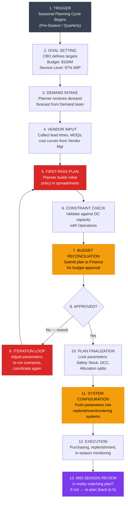
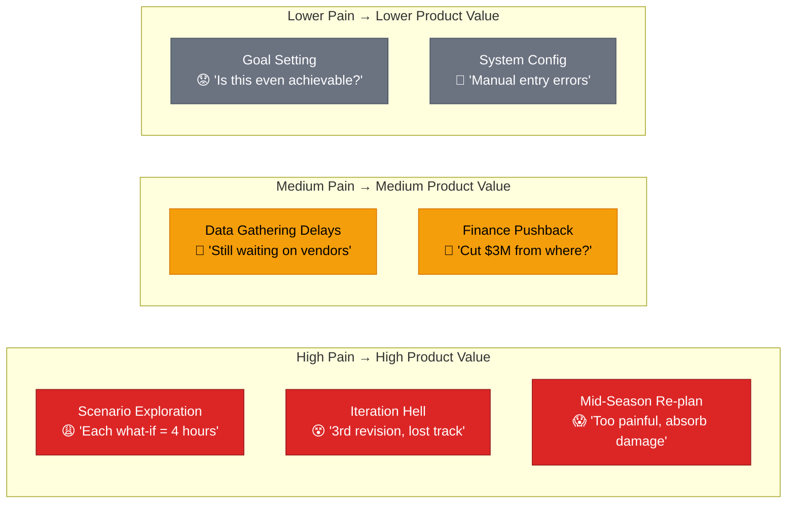

# Problem Reframe & User Workflow Map — Inventory Policy Workflow

## Why This Document Exists

In previous conversations, we evaluated 4 ideas, scored them, built a PlanPilot V0 prototype, and started a pressure test. But we skipped a crucial step: **we never mapped the actual user workflow with precision, or named the real problem clearly.** The prior framing — "budget → policy translator" — was a hypothesis, not a verified description of how this work actually happens.

This document does two things before anything gets built:
1. **Reframes the problem** — what it actually is, stripped of product-solution bias
2. **Maps the user workflow & journey** — step-by-step, with actors, tools, decisions, emotions, and pain points at each stage

---

## Part 1 — Problem Reframe

### 1.1 The Problem We Originally Described

> "A business owner at Target in charge of Department 123 says: my budget is $100M and my target is 97% walk-in purchasability. Today they use spreadsheets to figure out what that means in terms of safety stock, in-stock targets, seasonal allocation, etc."

### 1.2 What's Wrong With This Framing

The original framing has three blind spots:

| Blind Spot | Why It Matters |
|---|---|
| **It assumes the input is clean** — "budget = $100M, target = 97%" | In reality, the budget is negotiated, contested, and often revised mid-cycle. The target is a political compromise, not a clean number. The *input discovery* process is itself broken. |
| **It assumes the bottleneck is computation** | The 2-4 weeks may not be spent crunching numbers. Much of it could be coordination — waiting for Finance to approve, vendors to confirm lead times, ops to validate DC capacity. |
| **It frames the output as "configurations"** | The real output is a *committed plan* that multiple stakeholders have signed off on. Configuration (safety stock, DCC, etc.) is the artifact — the *work* is building consensus around trade-offs. |

### 1.3 Reframed Problem Statement

> [!IMPORTANT]
> **The core problem is not "translating budget to policy." The core problem is that inventory planning is a multi-stakeholder negotiation conducted through spreadsheets, where the cost of exploring alternatives is so high that teams commit to the first plan that's "good enough" — leaving millions in efficiency on the table.**

Let's break this down into its atomic components:

#### Component 1 — Scenario Exploration Is Prohibitively Expensive

Each "what if" (what if budget drops 10%? what if vendor X lead time doubles? what if we shift 5% from pre-season to in-season?) requires manually reworking formulas across multiple spreadsheets and coordinating the downstream impact with other teams. **The cost of asking "what if" is so high that planners stop asking after 2-3 scenarios.**

#### Component 2 — Cross-Functional Dependencies Create Sequential Bottlenecks

The planner can't finalize safety stock without knowing lead times (vendor team), can't finalize allocation without budget approval (finance), can't finalize in-stock targets without DC capacity (operations). These happen sequentially, not in parallel. Each handoff adds days.

#### Component 3 — The "Plan" Is Fragile and Non-Recoverable

Once the plan is set, it's extremely difficult to re-plan mid-season when reality diverges from assumptions. The same painful process must be repeated, but now under time pressure. Most teams just absorb the pain (excess markdowns, stockouts) rather than re-plan.

#### Component 4 — Institutional Knowledge Is Locked in Spreadsheet Formulas

The safety stock formulas, seasonal adjustment factors, and budget allocation logic live in inherited spreadsheets that few people fully understand. When a senior planner leaves, the logic goes with them. New planners copy-paste formulas without understanding the assumptions behind them.

### 1.4 What This Means for "What to Build"

If the reframe is accurate, the product opportunity is NOT just "run the optimization faster." It's:

| Layer | What It Solves | Why It's Valuable |
|---|---|---|
| **Speed layer** | Make scenario exploration instant | Planners go from 2-3 scenarios to 20+ in the same time |
| **Collaboration layer** | Surface cross-functional dependencies, allow parallel input | Break the sequential bottleneck (Finance, Vendors, Ops) |
| **Resilience layer** | Enable mid-season re-planning with low cost | Plans become living documents, not one-time artifacts |
| **Knowledge layer** | Externalize the logic from spreadsheets into a transparent model | De-risk institutional knowledge loss |

> [!WARNING]
> **Open question for you (Manisha):** Which of these 4 layers is the *most* painful? Where does the majority of the 2-4 weeks actually go? This determines whether V0 should be a scenario explorer, a collaboration tool, a re-planning engine, or a knowledge capture system.

---

## Part 2 — User Workflow Map

### 2.1 The Actors

Based on your idea description and industry research, here are the humans involved in this workflow:

| Actor | Role | What They Care About | When They're Involved |
|---|---|---|---|
| **Category Business Owner (CBO)** | Owns P&L for a department (e.g., Dept 123 — Home Essentials). Sets strategy. | Budget efficiency, service level, markdown risk, being on plan | Beginning and end of cycle; signs off on the final plan |
| **Inventory Planner** | Does the actual work of translating goals into inventory parameters | Getting the math right, not getting blamed for stockouts, finishing on time | Throughout — this is their primary job |
| **Finance Partner** | Controls budget guardrails, approves allocation | Staying within capex budget, minimizing working capital | Middle of cycle — approves or pushes back on budget ask |
| **Vendor/Supplier Manager** | Provides lead time, MOQ, cost information | Vendor performance, negotiated terms | Early cycle — provides inputs; late cycle — confirms POs |
| **Operations / DC Lead** | Validates distribution center capacity, labor constraints | Throughput, labor cost, receipt flow smoothness | Middle of cycle — validates plan feasibility |
| **Adjacent Category Owners** | Own related departments, share budget or shelf space | Their own P&L; cannibalization risk | Occasionally — when plans overlap or compete |
| **Demand Planning / Forecasting Team** | Provides demand forecasts | Forecast accuracy | Early cycle — delivers forecast; planners consume it |

> [!IMPORTANT]
> **Key question for you:** Is the primary user we're solving for the **Inventory Planner** (who does the hands-on work) or the **Category Business Owner** (who makes the strategic decisions)? These are different personas with different pain points.

### 2.2 The Workflow — Step by Step

Below is a reconstructed workflow based on your input, the pressure test questions, and industry research. **I need you to validate, correct, and fill gaps.**

### 2.3 Detailed Breakdown — What Happens at Each Step

#### Step 1-2: Trigger & Goal Setting
- **What happens:** The planning calendar triggers a new cycle (e.g., Fall/Holiday planning starts in April-May). The CBO sets top-level goals: budget envelope and service-level target.
- **Tools used:** Email, meetings, corporate planning documents
- **Time:** 1-3 days
- **Pain:** Goals may be handed down without enough context. "You have $100M and must hit 97% WIP" — but is that even achievable with current vendor landscape?

#### Step 3: Demand Intake
- **What happens:** The Inventory Planner receives a demand forecast from the Demand Planning team — typically at weekly/SKU-cluster/store-cluster granularity.
- **Tools used:** Blue Yonder / Oracle Retail / SAS Forecast Server outputs → exported to Excel
- **Time:** 1-2 days to receive, clean, and integrate
- **Pain:** Forecast is often at a higher aggregation level than needed. Planner has to disaggregate and apply local knowledge ("I know this store cluster over-indexes on Kitchen & Dining").

#### Step 4: Vendor Input
- **What happens:** Planner collects current lead times, MOQs, cost breaks, and any upcoming changes from the Vendor/Supplier Manager.
- **Tools used:** Email, vendor portals, shared spreadsheets
- **Time:** 2-5 days (waiting for vendor responses)
- **Pain:** Information arrives piecemeal. Some vendors are fast, others take a week. Planner has to chase. Lead times may change between when they're collected and when the plan is finalized.

#### Step 5: First-Pass Plan (🔴 PRIMARY PAIN ZONE)
- **What happens:** This is the core of the work. The planner opens their spreadsheet workbook (often 12-20 tabs) and:
  1. Segments items into A/B/C/R tiers based on demand volume, margin, strategic importance
  2. Sets a target service level (DCC / in-stock %) per tier — A items get 98%, C items get 90%, R items get 99%
  3. Calculates safety stock per item-store cluster using formulas that factor in demand variability, lead time, desired service level
  4. Runs an OTB (Open-to-Buy) calculation: `Planned Sales + Planned Markdowns + Planned End Inventory - Beginning Inventory - On-Order = OTB`
  5. Allocates budget across pre-season buy, in-season replenishment, and end-of-season markdown reserve
  6. Checks whether the total adds up to the budget. If not → adjusts service levels, safety stock, or allocation mix
- **Tools used:** Excel (primary), possibly Oracle Retail/BY for reference numbers
- **Time:** 3-7 days (hands-on-keyboard)
- **Pain:** This is iterative trial-and-error. Every parameter change cascades through the spreadsheet. Formulas are brittle and inherited. One wrong cell reference can silently corrupt the plan. **This is where most of the "what if" exploration should happen but doesn't, because each scenario takes hours.**

#### Step 6: Constraint Check
- **What happens:** Planner shares draft plan with Operations to validate that the receipt flow (inventory arriving at DCs) is achievable — does the DC have capacity to receive/process this volume in the proposed windows?
- **Tools used:** Email, meetings, shared spreadsheets
- **Time:** 2-3 days
- **Pain:** Operations often pushes back: "You can't send this much to DC North in Week 14, we're already at 95% capacity." Planner must then adjust the plan.

#### Step 7-8: Budget Reconciliation (🟡 SECONDARY PAIN ZONE)
- **What happens:** Planner submits the plan to Finance for approval. Finance checks: Does this plan fit within the allocated budget? Is the markdown reserve adequate? How does this compare to last year?
- **Tools used:** Spreadsheets, financial planning tools, meetings
- **Time:** 3-5 days
- **Pain:** Finance frequently pushes back: "Your plan requires $103M but the budget is $100M. Cut $3M." Planner must go back to Step 5 and re-optimize. But re-optimizing is painful, so they often just cut the lowest-priority items linearly rather than truly re-optimizing.

#### Step 9: Iteration Loop (🔴 COMPOUNDING PAIN)
- **What happens:** If Finance/Ops pushes back, the planner must rework. Each rework cycle goes through Steps 5→6→7 again. Typically 2-3 iterations.
- **Time:** 3-7 days per iteration
- **Pain:** Each iteration erodes confidence. The planner makes compromises to "just make the numbers work" rather than genuinely exploring what the best plan might be.

#### Step 10-11: Plan Finalization & System Configuration (🟡 RISK ZONE)
- **What happens:** The final approved plan is translated into system parameters — safety stock values, reorder points, DCC settings — and pushed into the replenishment/ordering systems (Blue Yonder, Oracle Retail, custom systems).
- **Tools used:** Manual entry into enterprise systems, sometimes bulk uploads via CSV
- **Time:** 1-3 days
- **Pain:** Manual transcription errors. The parameters in the system may not exactly match the spreadsheet because of rounding, system constraints, or human error. **There is often no automated check that the system configuration matches the approved plan.**

#### Step 12-13: Execution & Mid-Season Review (🟣 HIDDEN PAIN)
- **What happens:** The plan runs. Purchasing and replenishment happen based on the configured parameters. Periodically, the planner reviews: are actual results tracking to plan?
- **Pain:** When reality diverges (demand spike, vendor delay, competitor promo), re-planning is so painful that teams often absorb the damage rather than re-plan. **The cost of re-planning is nearly as high as the original planning cycle.**

---

## Part 3 — User Journey & Emotional Map

### 3.1 The Planner's Emotional Journey Through a Planning Cycle

| Phase | Duration | Emotional State | Internal Monologue |
|---|---|---|---|
| **Goal Received** | Day 1 | 😐 Neutral → 😟 Anxious | "Here we go again. $100M, 97% WIP. Is that even possible with current lead times?" |
| **Data Gathering** | Days 2-7 | 😤 Frustrated | "I've emailed vendor team 3 times. Still waiting on lead times for 4 key suppliers. Meanwhile, I can't start the real work." |
| **First-Pass Build** | Days 5-12 | 😰 Stressed, 🧐 Focused | "This spreadsheet is a monster. I inherited it from Raj and I don't fully understand the tab that calculates seasonal adjustment. If I change one number, 6 tabs break." |
| **Scenario Exploration** | Days 10-14 | 😩 Exhausted | "Finance will probably ask 'what if budget is $95M?' I should pre-build that scenario... but each one takes 4 hours and I'm already behind." |
| **Constraint Pushback** | Days 12-17 | 😤 Frustrated → 😡 Angry | "Ops says DC North can't handle my receipt flow in Week 14. Now I have to redo the allocation. Again." |
| **Finance Review** | Days 15-20 | 😬 Anxious | "If Finance asks me to cut $3M, I don't know where to cut without destroying my service level. I'll probably just reduce safety stock on C items and hope for the best." |
| **Iteration Hell** | Days 18-25 | 😵 Burnt Out | "This is the 3rd revision. I've lost track of what changed between v2 and v3. The spreadsheet has 4 copies with different names. Which one is current?" |
| **Plan Lock** | Days 22-28 | 😮‍💨 Relieved, 😨 Lingering Doubt | "It's done. It's not great. I had time for 2 scenarios. The approved plan is probably 15% less efficient than optimal but I can't keep iterating." |
| **Mid-Season Surprise** | Week 6+ | 😱 Panic | "Vendor X just doubled their lead time. My safety stock for their items is way too low. Re-planning would take 2 weeks. We'll just absorb the stockouts." |

### 3.2 The Emotional Journey Mapped to Product Opportunity

---

## Part 4 — Core Pain Points (Ranked)

### 4.1 The Pain Point Stack

| Rank | Pain Point | Who Feels It | Frequency | Severity | Why Current Tools Don't Solve It |
|---|---|---|---|---|---|
| **#1** | **Scenario exploration is prohibitively expensive** — each "what if" takes hours, so planners explore 2-3 scenarios instead of 20+ | Inventory Planner | Every planning cycle (4-6x/year) | 🔴 Critical — leaves millions on the table | Enterprise tools compute single-point answers, not interactive scenarios. Excel can't do constraint-aware optimization. |
| **#2** | **Iteration cycles with Finance/Ops are sequential and slow** — each pushback requires a full rework | Planner, Finance, Ops | 2-3 times per cycle | 🔴 Critical — adds 1-2 weeks to cycle | No shared workspace where all stakeholders see the trade-offs of their constraints in real time |
| **#3** | **Mid-season re-planning is too costly to do** — so teams absorb stockouts/markdowns instead | CBO, Planner | Multiple times per season | 🔴 Critical — this is where the biggest $ losses happen | Re-planning has the same cost as original planning, making it irrational under time pressure |
| **#4** | **Spreadsheet logic is fragile and opaque** — inherited formulas, broken references, no version control | Planner | Constant (every touch) | 🟡 Important — creates errors and onboarding barriers | Enterprise tools are rigid; planners supplement with spreadsheets because they need flexibility |
| **#5** | **Budget cuts require blind trade-offs** — when Finance says "cut $3M", there's no fast way to see where to cut with minimum service-level damage | Planner, CBO | 1-2 times per cycle | 🟡 Important — leads to suboptimal decisions | No tool links budget adjustment to service-level impact at item-cluster granularity in real time |
| **#6** | **Plan vs. system configuration gap** — manual transcription of parameters into enterprise systems introduces errors | Planner, Systems team | End of every cycle | 🟡 Important — silent errors with large downstream impact | Enterprise systems don't consume plan outputs directly from planners' tools |
| **#7** | **Data gathering is slow and piecemeal** — vendor lead times, demand forecasts arrive at different times, in different formats | Planner | Start of every cycle | 🟠 Moderate — adds 3-5 days | No centralized, real-time input surface for all stakeholders |

### 4.2 The One-Sentence Problem

> **Retail inventory planners are forced to make $100M decisions through trial-and-error in brittle spreadsheets, with no ability to instantly explore alternatives, no shared surface for cross-functional trade-offs, and no affordable way to re-plan when reality changes.**

---

## Part 5 — What I Need From You Before We Go Further

> [!IMPORTANT]
> **I need your input on the following before we build anything.** These are not nice-to-haves — each one directly shapes what we build.

### Critical Validation Questions

**V1. Workflow accuracy** — I've mapped 13 steps above. Walk through them and tell me:
- Which steps are accurate?
- Which steps are missing or out of order?
- Which steps take longer than I've estimated?
- Are there steps that don't happen at every retailer?

**V2. Primary bottleneck** — Of the 2-4 weeks in a planning cycle, roughly how much time goes to:
- a) Waiting for inputs (vendor lead times, demand forecasts) — ___%
- b) Hands-on-keyboard spreadsheet work — ___%
- c) Coordination meetings and email back-and-forth — ___%
- d) Waiting for approvals (Finance, CBO sign-off) — ___%

**V3. Primary user** — Is our primary user:
- a) The **Inventory Planner** (who does the hands-on work and suffers daily)
- b) The **Category Business Owner** (who makes strategic decisions and owns the P&L)
- c) Both (with different value props for each)

**V4. Pain ranking** — Review the 7 pain points in Section 4.1. Do you agree with the ranking? Would you reorder any? Are there pain points I'm missing?

**V5. Existing tools reality** — In your experience:
- What % of the workflow happens in Excel vs. enterprise tools (Blue Yonder, Oracle, etc.)?
- Do enterprise tools have *any* scenario exploration capability? How good/bad is it?
- When a planner needs to change a parameter, do they do it in the enterprise tool or in Excel first?

**V6. The item segmentation piece** — You mentioned A/B/C + R (reliability) segments. How are these segments defined today? Is this manual judgment or formula-driven? Does each segment get different service-level targets? How often do items move between segments?

**V7. The "decision layer" you described** — You said the product "goes and executes the strategy in production for basic configs and asks users before executing high-stakes decisions." Can you describe what "basic configs" vs. "high-stakes decisions" means concretely? Give me 2-3 examples of each.

---

## Verification Plan

### Before Building
- [ ] User validates workflow map (V1)
- [ ] User provides bottleneck breakdown (V2)
- [ ] Primary user persona confirmed (V3)
- [ ] Pain point ranking validated (V4)
- [ ] Tool reality check completed (V5)
- [ ] Segmentation workflow clarified (V6)
- [ ] Decision layer examples provided (V7)

### After Validation
- [ ] Update workflow map with corrections
- [ ] Finalize problem statement with validated details
- [ ] Define solution scope based on validated pain priority
- [ ] Build updated product architecture matching real workflow
